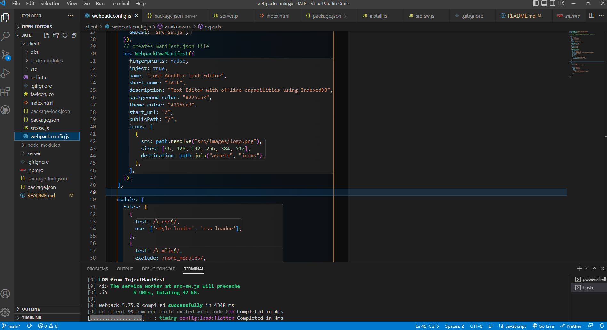

# JATE

## Link
Deploy app : https://watssupp.github.io/JATE/

## Description
Build a text editor that runs in the browser,that can also function offline. Using PWA criteria.

## Usage
- This is an open the text editor
- You will be able to create notes or code snippets with or without an internet 
- To retrive content in text editor, inspect page and take a look at the IndexDB
- Youll be able to download web application with a click of the install button 
- When down aplication it will pop up with an icon on desktop 

## Screen shots



## Instruiction to run application 
Once repo is cloned the user can open the terminal and  do the following 

Install dependacies
```
npm install
```
Run application with 
```
npm run start:dev
```
Enjoy the application!

